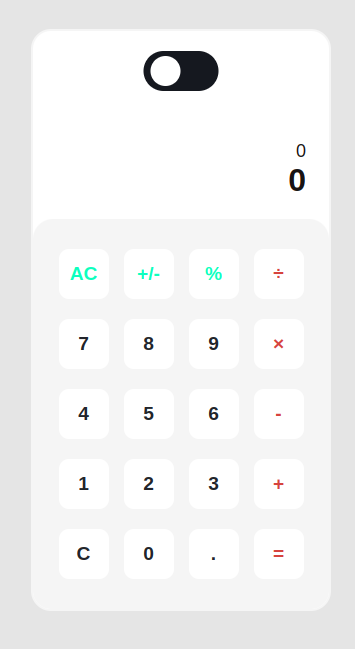
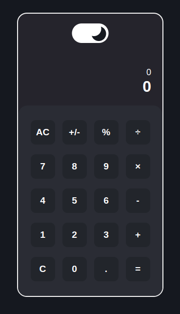

<a name="readme-top"></a>


<!-- PROJECT LOGO -->
<br />
<div align="center">
<h3 align="center">Calculator App</h3>

  <p align="center">
    Project Assignment - Calculator App
    <br />
    <a href="https://github.com/sidoelz123/calculatorApp"><strong>Explore the docs »</strong></a>
    <br />
    <br />
    <a href="https://github.com/github_username/repo_name">View Demo</a>
    ·
    <a href="https://github.com/sidoelz123/calculatorApp/issues">Report Bug</a>
    ·
    <a href="https://github.com/sidoelz123/calculatorApp/issues">Request Feature</a>
  </p>
</div>


<!-- TABLE OF CONTENTS -->
<details>
  <summary>Table of Contents</summary>
  <ol>
    <li>
      <a href="#about-the-project">About The Project</a>
      <ul>
        <li><a href="#built-with">Built With</a></li>
      </ul>
    </li>
    <li>
      <a href="#getting-started">Getting Started</a>
      <ul>
        <li><a href="#prerequisites">Prerequisites</a></li>
        <li><a href="#installation">Installation</a></li>
      </ul>
    </li>
    <li><a href="#roadmap">Roadmap</a></li>
  </ol>
</details>


<!-- ABOUT THE PROJECT -->
## About The Project




A calculator is a tool or software designed to perform mathematical calculations. Calculators can be physical devices that can be held and used manually, such as pocket calculators or desk calculators, or they can be software programs run on a computer or other electronic devices.

Calculators are highly useful in various contexts, including education, work, and daily life. They help simplify and expedite the process of mathematical calculations, reduce the risk of errors, and provide accurate results.

<p align="right">(<a href="#readme-top">back to top</a>)</p>


### Built With


<p align="right">(<a href="#readme-top">back to top</a>)</p>


<!-- GETTING STARTED -->
## Getting Started

### Prerequisites

Before running the application, first install the following dependency
* npm
  ```sh
  npm install live-server -g
  ```

### Installation

1. Clone the repo
   ```sh
   git clone https://github.com/sidoelz123/calculatorApp.git
   ```
2. Open folder
   ```sh
   cd calculatorApp
   ```
3. Running live server
   ```sh
   live-server .
   ```

<p align="right">(<a href="#readme-top">back to top</a>)</p>


<!-- ROADMAP -->
## Roadmap

- [x] Light/Dark mode
- [x] One Input Number
- [x] Feature clear/all clear
- [x] Feature Operations Number
- [x] Feature Inverse Number

See the [open issues](https://github.com/github_username/repo_name/issues) for a full list of proposed features (and known issues).

<p align="right">(<a href="#readme-top">back to top</a>)</p>

